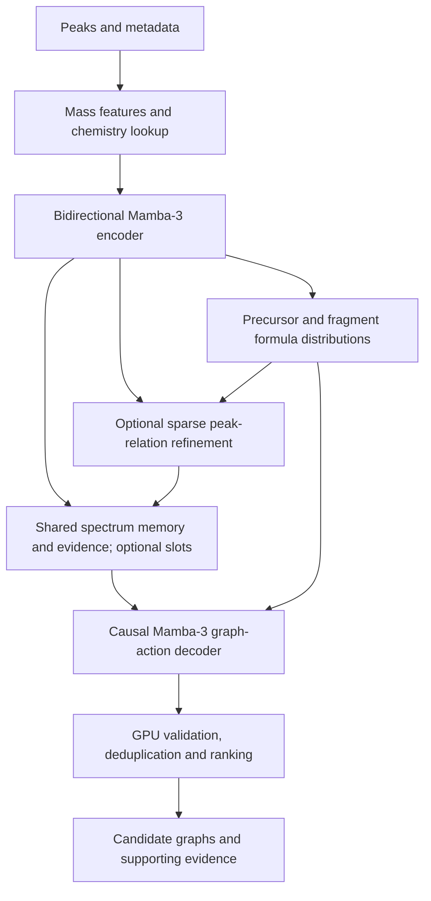

# MS2-to-substructure Mamba-3 design

Status: proposed; implementation and measurements are pending.

Implementation checklist: [MS2_SUBSTRUCTURE_TASKS.md](MS2_SUBSTRUCTURE_TASKS.md).

Review: [Opus 5.5 findings and disposition](MS2_SUBSTRUCTURE_REVIEW.md). Reviewer suggestions are evaluated against source and scientific constraints; arithmetic estimates are not benchmarks.

## 1. Objective and output semantics

Transform an MS2 peak sequence and measurement metadata into chemically interpretable representations, then generate multiple plausible connected molecular subgraphs. Use the repository's Rust/CubeCL stack for training and inference, with custom on-device GPU kernels where required. Optimize measured accuracy, latency, throughput, and memory together; no accuracy or speed improvement is established by this document.

Each candidate contains a parent-substructure graph, optional attachment points, compatible precursor formulas, associated fragment-ion hypotheses, supporting peak IDs and mass residuals, a ranking score, and calibrated confidence when calibration is available. Several returned substructures may coexist in the parent; their presence probabilities do not have to sum to one.

Keep parent substructures distinct from measured ions. Fragmentation may move hydrogens, change charge location, retain an adduct, or rearrange connectivity. An open subgraph has no unique capped molecular mass until attachment and hydrogen conventions are specified. Apply mass matching to an explicit ion hypothesis, not directly to an uncapped parent subgraph. Do not claim stereochemical identification from these inputs alone.

The first implementation supports a versioned chemistry domain: allowed elements, valence/charge states, bond types, ion/adduct transformations, mass range, and graph-size limits. Unsupported chemistry returns an explicit status. The deployed decoder and validator must share these rules. Broad chemical validity beyond that domain is a later extension, not an implicit guarantee.

### 1.1 Delivery order and decisions

Build a small **trainable vertical slice before specialized search and validation kernels**. This is a prerequisite for establishing that the spectrum supplies useful substructure information, not a relaxation of the final GPU requirement.

| Stage | Required behavior | Deliberately deferred |
|---|---|---|
| V0: feasibility | Composed CubeCL encoder/decoder, parent-containment labels, a small bounded formula table ranked on-device, independent sampled graph candidates, supported-domain GPU masks/validation, CPU/GPU gradient checks | Beam search, sparse learned relations, optimized formula joins, custom attention backward, general aromatic normalization |
| V1: complete inference | Bounded production formula search, fragment-assignment/evidence heads, sparse refinement where useful, GPU graph-identity checks, calibrated outputs where supported by labels | MIMO and expensive architecture changes |
| V2: measured optimization | Preallocation/fusion/layout tuning of proven bottlenecks; matched-quality candidate search and precision experiments | Any optimization lacking correctness and profile evidence |

V0 uses direct attention to retained peak embeddings, with per-decoder-layer K/V computed once per spectrum and shared across K and T. Slots, sparse relation networks, and online-softmax kernels are optional quality/memory experiments, not mandatory steps before a trainable model. V0 can return structural proposals with `evidence_status=unassigned`; it must not label them observed fragments or claim final evidence completeness. Validation and selection still execute on-device. Offline chemistry tools prepare labels and references only.

Recommended first domain: a dataset-justified subset of common organic elements and protonated/deprotonated singly charged species, explicit bond orders, and a bounded subgraph size. Freeze the actual element/valence table after the coverage audit. Unsupported metals, radicals, multiply charged ions, dimers, and rearrangements are explicitly excluded until implemented. Measure what fraction of evaluation data the domain excludes and keep that denominator in reports.

**Default generation is independent stratified sampling, with beam search an optional experiment.** Assign the total K trajectories across retained formula hypotheses on-device, update one owned recurrent cache per trajectory, and rank finished candidates. This removes ancestry copies and the beam-driven need for a second cache bank; a single-bank recurrence still requires a verified in-place step. Preserve formula/trajectory provenance and compare beam search later at matched quality, work budget, and memory.

## 2. Input contract and physical representation

| Input | Model representation | Validation and uncertainty |
|---|---|---|
| `prep_peaks` MS2 sequence | Exact-mass sidecar, scaled m/z, multiscale Fourier features, intensity, transformed intensity, precursor-relative m/z, neighboring mass gaps | Preserve original peak IDs and valid lengths; document normalization, filtering, binning, sorting, and truncation |
| Precursor m/z | Continuous features plus mass-compatible parent hypotheses | Positive and finite; not a unique molecular formula |
| Adduct ID | Categorical embedding plus a versioned chemistry lookup | Charge, elemental additions/losses, molecular multiplicity, and known/unknown status |
| Polarity | Two-category embedding | Accept only +1 or -1; validate against a known adduct's charge |
| Collision energy | Known value scaled using training statistics, known flag, learned missing-value embedding | Missing zero differs from measured zero; energy units must be dataset metadata |
| Energy count | Categorical embedding of capped count | Define whether 8 means exactly 8 or 8+; count does not reconstruct individual energies |

`prep_peaks` was not located in the inspected repository. Its adapter is a discovery task, not an assumed implementation. If it discards mass precision, accept a separate original-mass input or report that exact-mass constraints are unavailable. Never manufacture the discarded precision. Prevent double intensity transformations.

For an adduct interpretation `[nM+A]^z`, compute:

```text
neutral_mass = (abs(z) * precursor_mz - signed_ion_mass_contribution(A)) / n
```

Include electron/proton mass conventions explicitly. Intrinsically charged parent species use a charged-parent interpretation. Unknown adducts retain multiple supported hypotheses or return insufficient metadata; polarity alone does not determine charge magnitude.

For each peak i, the learned feature input is:

```text
x_i = MLP(concat(
    phi(mz_i), phi(precursor_mz - mz_i), mz_i / precursor_mz,
    relative_intensity_i, log1p(alpha * relative_intensity_i),
    log1p(neighbor_mass_gap_i), isotope_or_assignment_flags_i
))
```

Only include flags actually observed or inferred by the model; do not require unavailable isotope measurements. `phi` combines scaled continuous values with multiscale Fourier features. Precursor-minus-fragment m/z is a numerical difference until charge and adduct accounting justify a neutral-loss interpretation. Do not reject every peak above precursor m/z: multiply charged precursors can produce fragments with larger m/z.

Sort by m/z with deterministic ties; retain a mapping to original peak IDs. A configurable peak cap preserves weak diagnostic peaks using a documented selection policy. Report retained intensity and truncation. Invalid/empty spectra produce an explicit abstention or validation error, never arbitrary structures.

Instrument identity, mass accuracy, collision-energy units, and merging policy are missing from the stated per-spectrum inputs. Record them in dataset/config metadata where available. If energy units are mixed and unidentified, mask the energy value rather than treating unlike units as interchangeable. Merged counts condition uncertainty; they do not justify assigning peaks to invented energy bins.

## 3. Model architecture



### 3.1 Spectrum encoder

Use bidirectional Mamba-3 blocks with RMS normalization, residual connections, and measurement context injected through feature-wise modulation. Forward and reverse scans share the valid-length contract but have separate directional state. Reverse only valid positions; padding must neither update state nor contaminate pooling. Reset all relevant recurrent carries between spectra.

Mask with conditional selection, not multiplication: zero times a poisoned NaN is still NaN. Identity padding must preserve h, last_u, angle, and convolution history, not merely set delta to zero. In this implementation, overwriting last_u on a padded step can change the next valid trapezoidal update. Keep valid-length reversal as the reference; a full-buffer flip with identity padding is optional only after full-cache equivalence tests. Use the same full-cache freeze rule for finished decoder trajectories.

Use exponential-trapezoidal discretization and rotational state updates. The scan index orders m/z; it is not physical time, and a learned SSM step is not a fragmentation rate. Mass gaps remain explicit features rather than being equated with the SSM time step.

Start with SISO. Evaluate MIMO rank 4 only after measuring the actual implementation. The repository README describes a reference MIMO decomposition into R-squared SISO systems; paper-level decoding results are not a performance guarantee for this path or for short spectra.

### 3.2 Chemical hypothesis heads

Pool encoder features to rank bounded, mass-compatible precursor formulas. Retain top-F scores and probabilities explicitly conditional on the enumerated candidate set. If every enumerated candidate is scored, compute its log-partition by streaming log-sum-exp and report retained probability mass within that set. If scoring/search is truncated, mark this mass unavailable. Neither quantity is a posterior coverage guarantee over unenumerated chemistry. Record search truncation and evaluate true-formula recall separately.

Predict several fragment formula/ion assignments per selected peak. Include charge, supported adduct changes, hydrogen transfers, and an unassigned/noise state. Impose elemental conservation only after translating the parent and ion hypotheses into a common composition convention; adduct atoms and hydrogen transfers need explicit accounting.

Use a versioned mass index or meet-in-the-middle composition tables generated offline for the supported domain. Keep tables on-device during inference. Search bounded tiles and maintain running top-F candidates without materializing every combination. Make table size, enumeration limits, peak-assignment limits, and exhaustion visible. Broad formula enumeration can dominate runtime and must be profiled separately.

Bound search work as well as memory: configure table bytes, rows visited, matched formulas scored, fragment assignments examined, and score-tile capacity. A tiled Cartesian scan can have bounded memory and still unacceptable latency. Use indexed mass-range joins and conservative integer filters before neural scoring. Log visited/joined/scored counts and exhaustion. Initial small tables establish recall/latency curves before expanding the chemistry domain; no complete periodic-table enumeration is assumed. Compare this with bounded heteroatom/carbon enumeration that solves for hydrogen and verifies every possible integer hydrogen count within the mass window. Such enumeration can remove resident tables but still performs millions of checks; it is not automatically faster or complete under arbitrary caps. Check either implementation against brute force on small domains.

### 3.3 Sparse peak relations

Build candidate edges through sorted mass searches for supported losses and compatible formula differences. Each peak has at most k retained edges plus a validity mask. Score mass residual, formula difference, charge compatibility, and intensity relationship. Include generic nearby/learned candidates so a fixed loss dictionary does not define all possible chemistry.

When the sparse-relation ablation justifies it, apply two message-passing layers. Use destination-owned gathers/reductions for the forward pass and source-grouped adjacency for backward gathers. Do not require float atomics on the portable path. Budget both index orientations and construct them on-device. A supported atomic fast path is optional and must be compared with the deterministic gather reference. Do not form a dense N-by-N feature tensor.

### 3.4 Spectrum memory

The V0 memory is the full retained encoder output. An optional compression variant pools into r learned slots with masked attention and preserves a bounded bank of directly addressable evidence peaks. Slot attention and evidence access remain differentiable. At N=256 and r=32, one FP32 score matrix is only 32 KiB per spectrum per head, so custom online-softmax may cost more engineering/launch overhead than it saves. Measure complete activation/backward memory before adding it.

Compute the encoder and memory once per spectrum. Candidates reference the same read-only slots, keys/values, and peak evidence through spectrum IDs; do not replicate them K times.

### 3.5 Graph-action decoder

Use a causal Mamba-3 stack conditioned on spectrum memory, parent/fragment formula hypotheses, and the current partial graph. Initially store each atom's decoder hidden state at creation, concatenate current atom/valence features when computing pointer scores, and gather the same creation-step states during teacher forcing. This avoids requiring an incremental GNN before parallel training is available. A graph-state network is an optional quality ablation. Use a versioned atom-type vocabulary of element, charge, parent-convention hydrogen count, and supported valence state. The baseline action grammar is:

```text
START
ADD_ATOM(atom_type, parent_atom, bond_type)
CLOSE_RING(previous_atom, bond_type)  # other endpoint is the latest atom
STOP
```

The first atom has a special root parent. Subsequent atoms attach to existing atoms, guaranteeing connectivity. Masks prevent duplicate bonds, invalid references, forbidden valence, and impossible composition budgets. Parent-convention hydrogen counts remain fixed in atom tokens; added bonds consume residual valence. At STOP derive open attachment valence as supported valence minus retained bond orders minus attached hydrogen valence. It records missing external bonds and is not an atom. A residual of two does not distinguish one missing double bond from two missing single bonds: return allowed partitions/unknown bond type instead of inventing a unique port assignment. An optional explicit attachment head can be added only with defined supervision. Partial validity uses nonnegative residual valence, while final validity also checks size, charge/domain rules and the port convention. Do not cap residual valence with extra hydrogens and simultaneously count it as attachments.

Use an offline canonical atom traversal, emitting ring closures while their later endpoint is the newest atom; retain canonicalization/tool/domain versions. Randomized traversal is a later ablation. Different Kekule/resonance forms must have an explicit identity policy: V0 uses exact labeled bond graphs with offline-normalized targets, reports possible chemically equivalent duplicates, and makes no online aromatic-equivalence guarantee.

Use factorized action and pointer heads rather than a full vocabulary over every atom pair and attribute combination. Freeze factor order: action kind, atom type where applicable, bond order, then existing-atom pointer with masks conditioned on earlier fields. Candidate selection accumulates correctly normalized conditional log probabilities; independent greedy field choices are not equivalent to beam search. Apply the same legality masks during teacher forcing and inference. Offline reference bitsets and device masks must match exactly for each valid prefix; masked invalid logits contribute no normalization mass. Compare teacher-forced parallel decoder logits with stepwise logits including all carries, attention, and atom memory.

Generation explores formula/ion hypotheses and graph actions. K is the total live trajectory budget across all hypotheses, not an extra K for every formula. Start with independent sampled continuations using counter-based RNG keyed by stable spectrum ID, trajectory, step, and seed; optional beam search adds ancestry/cache gathering. Finished candidates have an absorbing state. Bound atoms by A and non-tree closure edges by R_max; the baseline grammar needs at most T=2+A+R_max tokens including START/STOP. For A=32 and R_max=8, T=42, optionally bucketed to 48. Mask additions/closures at their caps and emit STOP when legal. Otherwise record failure/abstention; a bounded runtime is guaranteed, successful chemical completion is not. Preserve incomplete/error handling for malformed histories or unsupported requests. Changes to the grammar require recalculating the bound and target coverage.

Represent an evidence-conditioned target by an explicit anchor: parent formula, selected peak/ion hypothesis when assigned, and graph-size or attachment context. A parent-contained graph with no validated ion mapping remains a structural proposal. A rule-backed atom mapping or learned mapping with labeled confidence connects parent subgraphs to ion graphs; unexplained rearrangements must not become hard mass constraints on parent connectivity. During training, define the target/anchor sampling distribution, multiple valid graphs/traversals, and loss normalization. These determine what a generation likelihood means.

### 3.6 Validation, identity, and confidence

Validate connectivity, supported valence and charge, hydrogen bookkeeping, attachment semantics, composition, and supported ring rules on-device. Initially decode explicit bond orders and use exact labeled-graph identity with offline-normalized targets. Broader on-device aromatic/resonance equivalence is a separate domain extension, not a hidden CPU normalization step. Cross-check rules offline against an established chemistry toolkit; no per-candidate toolkit calls are allowed in the GPU inference loop.

GPU structural hashes are a prefilter, not proof of graph equality. V0 may remove identical action traces only, preserving possible graph duplicates and labeling identity resolution incomplete. V1 adds bounded exact labeled-graph isomorphism checks within hash buckets, including attachment semantics. If a symmetry case exceeds its comparison budget, preserve both candidates and mark deduplication incomplete; never merge them solely because hashes match. Chemistry validity and unique-graph guarantees are separate statuses. A validated result may contain fewer than the requested number of candidates.

Use an on-device reranker over generation log-likelihood, formula log-prior, size, open valence, mass residuals, local peak support, and loss consistency; V0 can use a clearly labeled fixed-score baseline. Compare conditional generations across formulas using log p(formula|spectrum) + log p(trace|formula,spectrum), while keeping the reranker distinct from this trace score. A partial substructure need not explain the whole spectrum. A whole-parent fingerprint is not a target fingerprint for every subgraph.

The primary calibration target is candidate containment in the true parent under the versioned atom/bond/H/open-valence matching convention; report reliability by size and chemistry domain. Experimental ion-assignment confidence is a separate target requiring suitable labels. Train the reranker on out-of-fold/generated training candidates or a designated ranking-training split. Reserve separate validation/calibration data and an untouched test split; fitting the reranker and judging calibration on the same examples leaks supervision. Expose raw scores if calibration is unavailable.

Calibrate after the deployed search, validation, and deduplication policy. Version calibration with K/F, domain, precision, score normalization, and search policy; changed settings invalidate calibration until tested. Scores of different traversals of one graph are not exact graph posterior probabilities. Report candidate presence confidence separately from peak-assignment confidence and conditional formula scores.

## 4. GPU residency and precision contract

### 4.1 Host/device boundary

Host work is limited to I/O, schema validation, initial decimal/FP64 mass conversion, batching, offline chemistry-table/label preparation, launch scheduling, and final serialization. The runtime may submit kernels from the CPU; on-device execution does not require a single persistent GPU kernel.

After input upload, execute feature extraction, sorting/selection, formula ranking/search, sparse relations, encoder, slot pooling, graph decoding, masks, top-k/sampling, recurrent-state reordering, validation, deduplication, and scoring in CubeCL GPU kernels. No `.to_vec`, tensor `.item`, CPU top-k, per-step RDKit, or hidden device-to-host reads are permitted in this region.

Use a fixed maximum number of decoding steps with device-side alive masks initially. This avoids reading termination flags on every step. Masks do not automatically eliminate GEMM work for finished trajectories: report active trajectories per step, fraction of padded/finished work, and total submitted steps. Adaptive compaction or backend-specific indirect dispatch is a later, measured optimization; it must retain a portable path. Fetch final packed graphs, scores, evidence, lengths, and error flags in one batched read operation for one device/stream.

Keep lookup tables and model weights resident across requests. API calls accepting already resident inputs must not re-upload them. Training batches upload once; losses, backward propagation, gradient checks/clipping, and optimizer updates stay on-device. Read only aggregated metrics at configured reporting boundaries. Discrete candidate search is not differentiated; learned scores/representations and teacher-forced graph actions are.

### 4.2 Exact-mass decisions without requiring GPU FP64

Do not cast raw m/z to BF16/FP16. WGSL and some other target paths do not provide the precision/features needed for arbitrary FP64 chemistry, so FP64 everywhere is not a portable design.

Use two representations:

1. Versioned fixed-point integer masses for formula lookup and acceptance. Choose scale from the configured tolerance and maximum atom count. Prefer a single-u32 fast path when the domain-load proof establishes that all mass sums, charge products, tolerance expansions, and signed-difference operations fit safely. For example, microdalton units have a raw u32 range below 4294.968 Da, but intermediate bounds and required error tolerance impose stricter limits. Use native wide integers or a tested two-u32-limb implementation only for domains that need them. Perform signed differences/carry/borrow/range checks explicitly; no two-word atomic arithmetic is required in candidate-owned reductions.
2. FP32 continuous mass features and residuals for neural layers, with reduced precision only after feature construction. Accumulate reductions, softmax, log scores, normalization statistics, and baseline SSM states in FP32.

If each elemental mass is rounded once at scale S and then multiplied by its count, a formula with a total of a atoms has absolute quantization error at most a/(2S), before observed-mass/adduct rounding and conversion error. A table storing round(count * exact_element_mass * S) reduces that component to at most e/(2S) for e nonzero element types. Include all terms and input precision in the bound. Compare ion mass against abs(z) times observed m/z, scaling the tolerance consistently, to avoid division loss. Widen search windows to prevent roundoff-induced exclusion, but distinguish this candidate superset from final acceptance. Accept/reject only when the mass-error interval is wholly inside/outside the instrument tolerance; overlapping cases use a higher-resolution device representation or return `mass_boundary_ambiguous`. Test integer arithmetic exactly against a CPU integer oracle and the acceptance/error intervals independently against FP64/decimal calculations.

Separate integer-representation roundoff from instrument error and upstream preprocessing error. Include the uncertainty of an already-rounded FP32 input; converting it to a wide integer does not restore decimal precision. Require the total representation-error bound to fit a configured fraction of the smallest accepted mass tolerance, or return a precision-limit status. Higher-resolution retry may reduce arithmetic roundoff but cannot resolve instrument uncertainty. The portable initial path may return `mass_boundary_ambiguous` instead of implementing adaptive-precision retry.

FP16 requires overflow/loss-scaling handling in training. BF16 and specialized matrix operations require backend capability checks. Unsupported dtypes produce actionable errors or an explicitly selected FP32 configuration, never a silent change in chemistry precision.

## 5. CubeCL kernel plan

Reuse existing tested matmul, scan, indexing, normalization, sampling, and optimizer primitives before adding specialized kernels. The following are logical kernel families; exact fusion boundaries are chosen from profiles.

| ID | Kernel family | Layout / parallelism | Intended saving and correctness gate |
|---|---|---|---|
| K01 | Peak validation, normalization, mass features, metadata modulation | Structure-of-arrays input; contiguous feature output [B,N,d] | Fuse pointwise operations; preserve exact-mass sidecar and masks |
| K02 | Segmented peak sort/select and valid-length reversal | Per-spectrum segments; fixed shape buckets | Avoid host preprocessing round trips; deterministic ties and original IDs |
| K03 | Formula-table join, mass residual, constraints, running top-F | Bounded table tiles, candidate-owned output | Bound search workspace; report overflow/truncation |
| K04 | Mamba projections, parameter transforms, scan, residual | Existing tiled GEMM and scan layouts; direction-aware indexing | Fuse small epilogues; compare outputs and gradients with composed path |
| K05 | Sparse edge construction and relation gather/reduce | [B,N,k] IDs/masks; feature dimension contiguous | Avoid [B,N,N,d] and [B,N,k,d] persistent intermediates |
| K06 | Direct cross-attention; optional slot/evidence pooling | Shared per-spectrum per-layer keys/values; composed softmax first | Online softmax only if measured; handle all-masked inputs explicitly |
| K07 | Recurrent graph decoding and graph-state updates | [B,K,...], bounded atoms/edges; shared spectrum memory | Batched candidates, fixed state size per hypothesis |
| K08 | Legality mask, normalized action scoring, sample/optional top-k | Factorized heads; two-stage reductions | No host selection or full atom-pair action tensor |
| K09 | Optional beam ancestry and cache gather | Immutable source and disjoint destination banks | Absent in independent-sampling baseline; gather all carries when enabled |
| K10 | Graph validation, hash prefilter, exact comparisons, ranking | Candidate-local bounded work; tiled candidate comparisons | GPU output filtering; no hash-only deduplication |
| K11 | Training backward, gradient accumulation and optimizer | Reuse autograd/optimizer; add VJPs for new fused ops | Training parity, bounded activation memory, no hidden reads |

Do not fuse the entire model into one kernel. Large GEMMs, scans, and inter-cube dependencies remain separate when fusion would raise register pressure, reduce occupancy, or require unsupported global barriers.

Use runtime properties for cube size, plane support, shared-memory limits, dtype, and vector widths. Map adjacent lanes to contiguous features. Validate alignment/divisibility and provide scalar tails. For vector arguments, pass scalar element counts to `ArrayArg::from_raw_parts`, not vector counts. Use per-axis grid builtins and account for X/Y/Z when computing strides; the manual documents portability problems with aggregate builtins in the pinned version.

Use a non-plane reduction fallback. Avoid redundant host upload copies where the pinned API supports ownership transfer. Poison output buffers in new-kernel and autotune tests with NaN/integer sentinels, then verify all logically required outputs are written; masked/padded regions follow an explicit initialized-or-unread contract. Synchronize/check runtime errors at test boundaries so an unexecuted kernel cannot accidentally pass with old buffer contents.

Shared-memory producers and consumers require uniform barriers, including safe reuse between loop iterations. Inactive lanes must participate in required barriers. Test multiple cubes on CPU and GPU, because compilation alone does not verify runtime lowering or shared-memory behavior. Use unchecked launches only with documented shape/index/alias proofs and explicit guards for runtime-generated graph and edge indices.

## 6. Memory budget and ownership

Define B = spectra per batch, N = peak cap, d = hidden width, k = sparse degree, r = slots, F = precursor hypotheses, J = retained assignments per selected peak, K = total live candidates, A = atom cap, T = action cap, Ld = decoder layers, h = SSM heads, p = per-head channel width, s = state dimension. All capacity products use checked size arithmetic.

| Buffer | Approximate size / policy |
|---|---|
| Encoder ping-pong activations | 2 B N d activation elements for inference, plus separately budgeted projections/scan workspace |
| Sparse relations | B N k indices, masks, and compact relation attributes; stream message features |
| Formula hypotheses | B F composition records plus bounded assignment records and table-search workspace |
| Spectrum memory | Baseline B N d; optional B r d slots plus evidence. Per-layer K/V cache is 2 Ld B M d_kv elements, M=N or r+evidence; no K replication |
| Decoder recurrent state | B K Ld [2 h p s + h s/2] FP32 elements for current rotational SISO h, last_u, and angle; add convolution carry if enabled |
| Optional beam cache banks | Two full recurrent-cache banks for ancestry gathering; independent sampling starts with one owned bank if the step kernel permits safe in-place update |
| Graph state | B K A atom records plus bounded sparse edge/attachment records and graph embeddings |
| Action workspace | Tiled/factorized logits and top-k partials, not all atom-pair/attribute combinations |
| Candidate history | Sampling: B K T actions. Beam mode: immutable time-indexed ancestry/action records plus device trace reconstruction; mutable beam slots alone are insufficient |
| Readout | Packed final graphs/evidence/status arrays |

The current [SsmState](../src/ssm/scan.rs) stores h and last_u with the same [batch,heads,head_dim,d_state] shape, plus angle [batch,heads,d_state/2]. With B=8, K=32, Ld=4, h=8, p=32, s=64 and FP32, h=64 MiB, last_u=64 MiB, angle=1 MiB: **129 MiB per full cache bank and 258 MiB for two**, before convolution/history/graph state. Copying full caches at 128 beam steps (the superseded trace cap) implies **32.25 GiB of logical read/write traffic**; 48 steps imply about **12.09 GiB**. These are byte-count calculations, not measured bandwidth or latency. Derive final budgets from actual cache shapes and dtypes, especially for MIMO. For SISO, enforce h*p=d_inner and specify d_inner separately from d_model: the example uses d_inner=256, not an implicit expansion to 512. Encoder and decoder may use different widths/states.

Factorizing last_u into previous input/projection factors is a potential SISO memory optimization, not an existing capability. It changes cache representation and recurrent kernels, adds recomputation, and must be proven equivalent for the repository's trapezoidal and rotational formulation. Keep the full last_u in every estimate until such a path is implemented and profiled; MIMO can require additional factors. Do not inherit a reduced cache estimate from a different implementation.

Create a per-device, per-shape workspace before execution. V0 uses ordinary preallocated typed tensors on one stream; an arena/sub-buffer framework and concurrent pool leases are not prerequisites. Add those only if measured allocation/binding overhead or serving requirements justify them. Track ownership, aliases, and lifetimes. Reuse memory only after the consuming work is ordered complete on the owning stream. Concurrent execution, when added, requires separate workspaces or exclusive leases and tests against cross-request aliasing.

Use reusable output-buffer APIs for hot operators; allocator pooling alone does not establish zero allocation. Independent trajectories can update owned h/last_u/angle after all old values needed by the step have been read; prove this against the out-of-place reference. If the existing recurrence requires separate input/output banks, retain them and budget honestly until an in-place kernel is verified. Beam mode must gather source states into disjoint destination banks; read-only aliasing does not permit siblings to update the same cache. An optional fused gather-and-step can remove an intermediate copy, but still reads the required parent data and needs its own parity gate. Preallocate active-index and graph-gather scratch too.

For beam history, keep immutable [time,spectrum,beam] parent-slot/action entries, a bounded finished-result store with length and final-node references, and a device traceback kernel. Reordering or recycling live slots must not overwrite ancestors needed by surviving or completed graphs. Graph records and RNG identities must follow the same ancestry as recurrent state.

Report logical live bytes, peak live bytes, allocator-reserved bytes, allocation calls, and upload/download bytes separately. A flat pool high-water mark does not prove the absence of allocation churn. If the runtime cannot report a metric, record it as unavailable rather than zero.

Training has a different budget: weights, FP32 master weights if needed, optimizer moments, gradients, layer activations, scan intermediates, graph targets, and backward workspace. Measure each composed block before choosing activation-checkpoint boundaries; use teacher-forced action-length buckets and microbatch gradient accumulation when needed. Multiple subgraph targets share one spectrum encoding per optimizer microbatch; do not replicate/recompute the encoder per target. Checkpointed stochastic operations must reproduce RNG/masks, and gradient reduction must account for variable target/action counts. Do not claim recurrent inference's constant history memory for full-sequence training. New fused operations require backward implementations or explicit recomputation recipes; an inference-only kernel is not a training implementation.

Refuse a configuration exceeding the user memory limit before allocation. Offer documented reductions in B/K/N/A/T only as explicit configuration choices; never silently reduce candidate diversity or discard peaks to satisfy the allocator. Variable inputs use a small bounded set of shape buckets with an eviction policy for workspace caches.

## 7. Speed optimization sequence and measurement gates

1. Establish independent chemistry/CPU references and a composed CubeCL path with the same model weights and search budget.
2. Add stage profiling before changing performance behavior. Use CubeCL `client.profile`, record device versus system timing, and measure synchronized end-to-end latency separately. Separate JIT/tuning cold start from warm execution.
3. Remove repeated uploads, per-step reads, per-candidate launches, and unnecessary layout copies. Cache invariants and batch final readback.
4. Introduce preallocated workspaces and shared candidate context. Verify allocation-call and cache-growth behavior, then re-profile.
5. Fix measured coalescing problems and use bounded gather/reduction tiling. Compare against a same-traffic contiguous baseline where useful.
6. Fuse feature transforms, parameter epilogues, residual/norm operations, and mask/selection stages only when they improve end-to-end latency or memory. Check register/shared-memory pressure and backward cost.
7. Tune GEMM/scan/top-k launch geometry and vector widths by backend and shape bucket. Measure every candidate for correctness first. Consider MIMO, additional compaction, and asynchronous staging only after these baselines.
8. Repeat quality evaluation when changing precision, search budgets, peak retention, or model architecture. These are algorithmic changes, not numerically equivalent kernel optimizations.

Budget launches explicitly: L_call = L_preprocess + L_encoder + L_search + T*L_step + L_finalize, with separate kernel families and batch/trajectory sizes in the report. Reducing the old T=128 to a domain-valid bucket T=48 cuts the number of scheduled decoder iterations by about 2.67x, not necessarily wall-clock latency. Measure CPU submission time and device idle gaps before attributing a bottleneck to math. Tune B*K batching, trace caps, and fusion under memory and quality constraints; short spectra may be launch-bound. Early-exit flags save kernel work only where implemented and do not remove host submissions.

Use existing launch/read counters and reserved-memory helpers in `src/backend.rs`; extend them to count allocation calls, transfers, and any direct runtime reads bypassing helpers. Add a dedicated `profile_ms2_substructure` example modeled on existing profile examples. Keep intrusive profiling separate from headline latency measurements.

For hardware attribution, use Nsight on CUDA, ROCm tools on HIP, and Metal tooling or WGPU timestamps where available on Apple hardware. Record unavailable counters explicitly. CPU results provide correctness and CPU performance evidence, not GPU speed claims.

Autotune keys include device/backend, dtype, layout, shape bucket, and relevant kernel/config version. Benchmark mutable-state kernels on reset scratch state. Bound compile-time variants. Verify the pinned CubeCL API before using manual snippets; the repository declares CubeCL 0.10.0, and some manual examples use different backend feature names. Persist compilation caches only with kernel-source/dependency/compiler/backend invalidation; autotune cache and compiled-kernel cache are distinct.

Acceptance requires zero intermediate inference reads between upload and final batched output, no request-sized buffer allocations inside the warmed decoder loop, bounded reserved memory under repeated fixed-shape requests, and profiler evidence for each claimed improvement. Treat profiler-induced synchronizations separately from production-path reads. Run process-global counter tests in isolated test executables or serialized sections. Default stability protocol: warm every tested bucket until caches settle, then run at least 200 fixed-shape requests and an alternating-bucket sequence; record warmup count and test determinism. Set hardware-specific latency and memory targets after recording the baseline. Retain a simpler path if an optimization fails to improve the relevant workload.

## 8. Training and evaluation

First build a small supervised end-to-end slice before large graph pretraining. Pretrain graph actions on connected parent subgraphs only after target semantics are testable. Jointly train spectrum-conditioned graph generation and supported formula/assignment supervision; spectrum/structure contrastive training is a later optional objective. Use confidence-weighted fragment labels or marginalize plausible assignments; not every possible subgraph is an observed fragment.

Store supervision as sets of parent-contained graphs plus optional evidence-anchored ion mappings. Define graph sampling (size/rarity/attachment strata), canonical traversals first, and weighting per molecule versus per spectrum/target. Missing fragment annotations are unknown, not negative labels. Optimize the target mixture rather than forcing a spectrum to have one graph target. Graph teacher forcing may use a labeled true formula during supervised training; record and measure this train/inference gap. If training with predicted formulas, use compatible targets and report excluded target weight. Normal evaluation uses predicted formulas; known-formula inference is a separately labeled diagnostic/upper-bound mode.

Concrete initial recipe: enumerate bounded connected parent subgraphs by bond cuts, retain parent H/valence conventions and cut-bond labels, then generate only rule-supported ion mappings. If no experimental assignment exists, peak matches are pseudo-labels with recorded rule/version provenance. For a matched peak, distribute its intensity among compatible candidate graphs and sum per graph; normalize across targets within the spectrum to define q_b(g). Unmatched spectra use a separately identified size-stratified containment objective, not fabricated fragment labels. Validate the rule set on labeled examples before claiming evidence accuracy; open-valence units alone do not determine hydrogenation or an ion formula.

For the baseline define L_graph = mean_b sum_g q_b(g) * [-sum_t log p(a_t|a_<t,spectrum_b,formula)], including STOP and excluding padding. Fix any size reweighting before training. Multiple targets share one encoder evaluation; accumulation uses the same spectrum/target weights across microbatches. Formula cross-entropy is computed only with a specified enumerated support and explicit missing-gold handling. Assignment loss is -log sum of probabilities over supported valid assignments, with an explicit noise class. Evidence loss is supervised only where assignment labels or labeled pseudo-label confidence exist; no label means no negative loss. V0 needs the graph and supported formula losses only. Contrastive loss is optional until its molecular encoder, positive/negative definition, and memory cost are specified.

Before custom kernel work beyond the minimum path, run a 32-128-pair overfit fixture and a molecule-disjoint pilot. Include a shuffled-spectrum and metadata-only control to determine whether the model uses spectral evidence instead of memorizing a graph prior. Parent-containment labels alone support structural-proposal evaluation, not experimental fragment correctness. If the data cannot support the intended ion mapping/evidence target, stop that accuracy claim and report the missing supervision.

```text
L = L_graph + lambda_f L_formula + lambda_a L_assignment
    + lambda_e L_local_evidence + lambda_c L_contrastive
```

An optional FPNet-style fingerprint head supplies whole-parent auxiliary supervision. It is not a connectivity representation or a required bottleneck. Include same-formula isomers as hard negatives. Do not penalize a valid partial substructure for unexplained peaks from other parts of the molecule.

Keep every spectrum/adduct/energy condition of a molecule in one data split; add scaffold and instrument holdouts. Fit preprocessing statistics, dictionaries learned from structures, and confidence calibration using training/validation data only. Audit structural pretraining leakage separately.

Report formula recall before pruning, substructure precision/coverage at K, graph validity, uniqueness, graph-size-stratified metrics, attachment correctness, evidence agreement, calibration, abstention, and domain/search overflow rates. Atom-level containment metrics require a known parent; experimental fragment-assignment accuracy requires suitable annotations. Do not conflate the two. Evaluate information/size so trivial fragments cannot inflate results.

Benchmark against FPNet where available, a set encoder, and a parameter-matched Transformer. Ablate formulas, sparse relations, bidirectionality, memory slots/evidence bank, SISO/MIMO, and precision. Compare latency/quality at matched candidate budgets and report kernel time, end-to-end p50/p95 latency, spectra/s, peak memory, compilation time, launch count, and transfer volume.

Initial V0 configuration: N=128, encoder=2 bidirectional blocks, d=128, s=32, decoder=2 causal blocks, F<=4, K=8 independent trajectories, A=16, and a trace cap derived from the selected domain. Use FP32 and ordinary composed attention first. This is a learnability/profiling fixture, not the production quality target.

V1 candidate configuration: N=256, encoder=6 bidirectional blocks, encoder d=256/s=64, decoder=4 causal blocks with separately configured d_model/d_inner and s in {16,32,64}, K=32, returned candidates<=10, A=32, R_max=8, T=42 (bucket 48). Optional relations use k=8; optional slots use r=32. Choose F from measured recall@F (initially evaluate 4 to 8). These caps require dataset and action-trace coverage checks. Retained assignments J, table bytes, and search-work limits must be measured before production defaults. Measure K in {1,8,32} and report quality versus latency at a fixed memory budget; identical K does not imply identical work for sampling and beam search.

## 9. Repository integration and open decisions

Proposed new modules: `src/models/ms2/` for chemistry contracts/model/generation/workspace; `src/tensor/ops/ms2/` for custom kernels; corresponding autograd operations; `bindings/python/src/ms2.rs` and public Python types; focused CPU/GPU tests and a profiling example. These paths are plans, not existing features.

Reuse `src/models/mamba3.rs`, `src/models/entity/blocks.rs`, `src/ssm/`, existing tensor primitives, and the backend's device/stream conventions. Extract shared functionality only when duplication would otherwise arise. Preserve Rust/Python feature parity for configuration, training, generation, dtype/device handling, checkpointing, evidence, and errors.

Before implementation, resolve the actual `prep_peaks` contract; available paired structures/fragment annotations; supported chemistry; mass tolerances/energy units; target hardware; calibration target; and initial memory/latency budgets. These do not prevent building contracts, synthetic fixtures, and reference kernels, but missing real data prevents accuracy claims. GPU canonicalization/aromaticity coverage, search-table growth, recurrent beam memory, and short-sequence launch overhead are explicit technical risks to measure.

## 10. Sources used

Local CubeCL manual sections read for this plan:

- [Manual index](/Users/ods/Documents/cubecl_manual/manual/Cubecl/INDEX.md).
- [Kernel fusion](/Users/ods/Documents/cubecl_manual/manual/Cubecl/03_kernel_fusion.md) and [memory coalescing](/Users/ods/Documents/cubecl_manual/manual/Cubecl/07_memory_coalescing.md).
- [Launch overhead and transfers](/Users/ods/Documents/cubecl_manual/manual/Cubecl/11_launch_overhead_and_transfers.md) and [memory preallocation](/Users/ods/Documents/cubecl_manual/manual/Cubecl/13_memory_preallocation.md).
- [Buffer slicing](/Users/ods/Documents/cubecl_manual/manual/Cubecl/Backend-Agnostic_Buffer_Slicing_and_Multi-Logical_Array_Allocation.md), [shared memory](/Users/ods/Documents/cubecl_manual/manual/Cubecl/Cubecl_shared_memory.md), and [adaptive launch geometry](/Users/ods/Documents/cubecl_manual/manual/Cubecl/Hardware-Adaptive_Launch_Geometry.md).
- [Vectorization](/Users/ods/Documents/cubecl_manual/manual/Cubecl/06_vectorization.md), [autotuning](/Users/ods/Documents/cubecl_manual/manual/Cubecl/12_autotuning.md), and [compilation caching](/Users/ods/Documents/cubecl_manual/manual/Cubecl/Cubecl_compilation_caching.md).
- [Profiling tools](/Users/ods/Documents/cubecl_manual/manual/Cubecl/profiling_tools.md) and [bottleneck identification](/Users/ods/Documents/cubecl_manual/manual/Cubecl/16_profiling_and_bottleneck_identification.md).

Research and upstream references:

- [Mamba-3](https://arxiv.org/abs/2603.15569): sequence backbone; published language-model results do not establish MS2 performance.
- [MIST](https://github.com/samgoldman97/mist) and [MIST-CF](https://arxiv.org/abs/2307.08240): formula-based representations and formula ranking.
- [ICEBERG](https://pmc.ncbi.nlm.nih.gov/articles/PMC12573212/): fragment generation and hydrogen-shift modeling; its forward prediction task differs from this inverse task.
- [SIRIUS adduct documentation](https://v6.docs.sirius-ms.io/adducts/): adduct/ionization interpretation.
- [MassSpecGym](https://github.com/pluskal-lab/MassSpecGym): evaluation context and data splits; custom substructure metrics are still required.
- [CubeCL upstream](https://github.com/tracel-ai/cubecl): runtime/compiler overview; use this repository's pinned API for implementation.
- [Repository test guidelines](test_guidline.md): run CPU and GPU tests and verify Python/Rust API parity.
